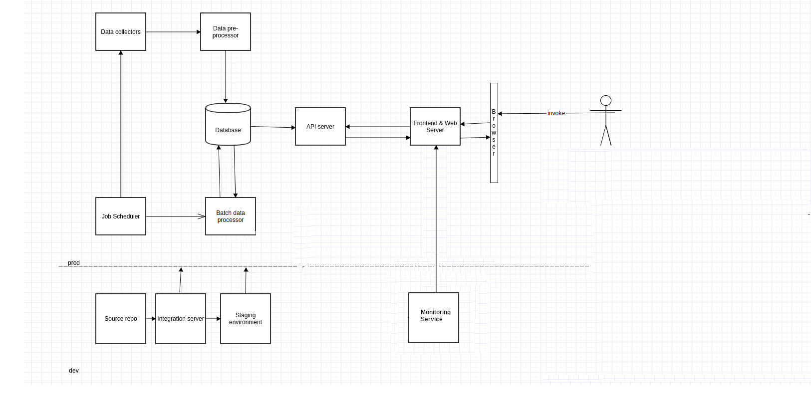
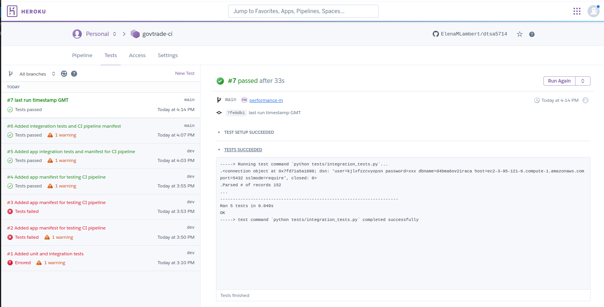
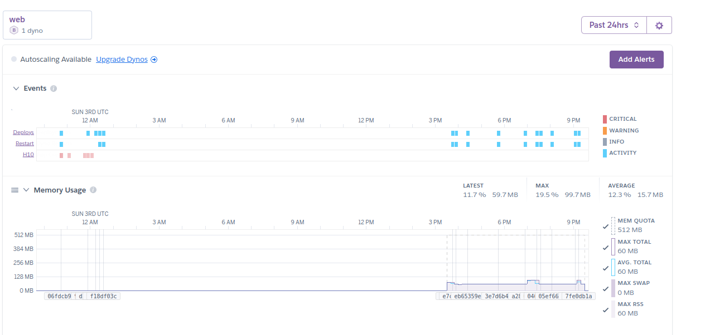

<strong>Project description: </strong>
The problem my project is aimed at solving is combating the distributed, unorganized information of government officials’ financial decisions. my project is for anyone who is interested in government officials’ financial disclosures and including their stocks and options transactions records. my project is unique because it identifies the ways in which political activities correlate with government officials’ financial transactions records. This enables transparency, eliminates the potential for insider trading, and identifies potential conflicts of interest. It allows retail investors to monitor and subsequently follow their trades before restrictions are made. 
<strong>Applicaiton Stack Architecture:</strong>
## Overview

### Architecture

 

Architecture Description
1. Data collectors use urllib to fetch two main public sites.

2. Data pre-processor converts downloaded csv data to structured raw data and insert/update corresponding tables in database.
 
3. Job scheduler has two jobs. 

   a. invoke periodical data collectors and preprocessor.

   b. invoke batch data processor to transform structured raw data to application data structures and save update them to database.

4. Batch data processor does data transformation, data analysis and storing data for API server to use.

5. API server provides endpoints for application servera /dashboardb /search (by name/filing date/stock symbol)

6. Integration server: This component facilitates the integration and deployment of the application code from the source repository to the staging environment.

6. Frontend server uses template language to serve html pages from API server endpoints.

7. Web server reverse proxy for application server

8. Integration server does: 

    a. monitoring health of endpoints on api server, frontend, and web server.                                                                                            
    b. continuous integration testing by code change and build

Initial architecture diagram(Week 1) is almost identical, only design changes are:
1. Relational(Postgresql) database was chosen instead of a document database. Initially I thought application needs store raw pdf files per record, which is large amount of data for relational database to handle. But in my development stage I could parse trades text in pdf files, that significantly reduced data amount to data store. Also search ability is more robust when using a relational database built in sql query.
2. Performance metrics services were added, using heroku managed ones.

### Continuous Delivery
### 
 Application integrates with GitHub to make it easy to deploy to my app stack running on Heroku. When GitHub integration is configured for my app, Heroku can automatically build and release (if the build is successful).
 Continuous Delivery is implemented by using Heroku pipeline, it runs function & unit tests automatically for every subsequent code push to the GitHub.  Along with any merges to master from dev branch that is used as staging. Staging will be promoted to production servers after tests.
 A few illustrative tests were written using standard pytest library and running continously upon each code change in GitHub.
### 

Staging environment: This is a pre-production environment where the application is deployed and tested before being released to the production environment.

### 

### Monitoring and Performance Metrics
 Monitoring service monitors the system's performance, health, and potential issues, providing visibility and alerting mechanisms.
 Heroku provides server performance metrics and alert services, it includes monotroing applicaiton Response time, Memory, Throughput. Alert service will send notifications upon system events in production, such as unresponsive endpoints, resource exhaustions, throughput over certain threshold limit.

### 
### 

 

<strong>Code Structure:</strong>

### Web Application ([app.py](src/app.py)/[service.py](src/service.py))
 1. Standard Python Flask web app, that routes http requests and responds with templated data from database on web pages.
 2. Apscheduler BackgroundScheduler is started when app.py starts, it runs [fetcher.py](src/fetcher.py) 'main' method periodcally. The timestamp of data collection is displayed on the bottom of the site page.
 3. [service.py](src/service.py) provides db records for the endpoint by retrieving them from database. It does certain data convertions on unstructured raw trades data.

#### Data Collection
1. [fetcher.py](src/fetcher.py) uses Python requests lib to fetch two main public sites.
  respectively: 
    - https://disclosures-clerk.house.gov/public_disc/financial-pdfs/{year}FD.zip all congress members' trades disclosed in the year.
    - https://disclosures-clerk.house.gov/public_disc/ptr-pdfs/2024/{docId} individual trade disclosure doc record.
    
    - attaches individual parsed trade doc to record
    - save records to postgresql database (hosted in Heroku)
    - has function to collect multi years records.

2. [processor.py](src/processor.py) helps fetcher.py convert raw data to structured records, extracts trades from trade pdf doc per record.
3. [db.py](src/db.py) inserts/update/remove gov trades records to a postgresql database hosted in heroku.
4. DB connection parameters are in .env file.
Sample db records screenshot [here](static/img/db_records.png).

#### Frontend
HTML page provides user to view/search/select goverment trading records. Application server is running a python flask stack. sort/search functionality uses sortable.js, bottom 'last run' displays data collection time.

#### <strong>Public url of my project:   </strong>    [https://govtrade-a46bca12cc9b.herokuapp.com/](https://govtrade-a46bca12cc9b.herokuapp.com/)

#### Run project code locally, under project root directory:
    python3 -m venv venv
    source ./venv/bin/activate
    pip install -r requirements.txt
    export FLASK_APP=src/app.py
    flask run --port 1234 --debug `

